  <a href="https://github.com/Andres42611">
    <picture>
      <source media="(prefers-color-scheme: dark)" srcset="assets/banner-dark.svg" />
      <source media="(prefers-color-scheme: light)" srcset="assets/banner-light.svg" />
      
    </picture>
  </a>

I develop methods for population genetics and machine learning and release them as installable, reproducible software. My packages compute the statistics (PADZE for allelic diversity, Rab for mutational load), and my current work applies machine learning to them: DNNaic recovers the direction of gene flow between populations, which symmetric statistics like Patterson's D cannot.

### Currently building

**[DNNaic](https://github.com/yspennstate/DNNaic)** &nbsp;·&nbsp; *the direction of gene flow, inferred with deep learning*
> Infers the direction of introgression between populations from nine allelic-rarefaction statistics (computed with PADZE), using a two-stage network that first detects appreciable gene flow, then orients it with no outgroup required. Patterson's D detects gene flow but is symmetric under swapping donor and recipient; the rarefaction features keep the labels D discards, so the direction is recoverable. On coalescent simulations this reaches **three-way direction accuracy up to 96.6%** at the largest fixed migration rate and 99.7% across the appreciable band. On real data it recovers the *melpomene* to *timareta* direction in the *Heliconius* butterfly complex, and abstains on the Neanderthal case, where rarefaction depth is too shallow, instead of forcing a call. First author (with Yitzchak Shmalo).
>
> **[Repository](https://github.com/yspennstate/DNNaic)**

**[PADZE](https://github.com/Andres42611/PADZE)** &nbsp;·&nbsp; *a Python successor to ADZE, on PyPI*
> Reads VCFs directly and reproduces the original C++ ADZE allelic-diversity output exactly in classical mode, verified by **82 automated tests**. Adds higher-order across-loci moments (skewness and excess kurtosis) and depends only on NumPy at runtime. Released on PyPI as v0.1.0 (`pip install padze`); it is the feature engine behind DNNaic.
>
> **[Repository](https://github.com/Andres42611/PADZE)** &nbsp;·&nbsp; **[Live on PyPI](https://pypi.org/project/padze/)**

**[SegViT Audio](https://github.com/Andres42611/SegVit)** &nbsp;·&nbsp; *a vision transformer repurposed for audio segues*
> Adapts a Vision Transformer to continue audio waveforms and generate short bridges between songs. Early alpha: a learned destination-aware segue is not yet established, since the current neural path sees only the outgoing song and an equal-power crossfade remains the baseline. Ships a model card and a findings ledger that state exactly that.
>
> **[Repository](https://github.com/Andres42611/SegVit)**

### Selected work

**[Rab](https://github.com/Andres42611/Rab)** &nbsp;·&nbsp; *deleterious load between populations, corrected for kinship*
> Computes the R(X,Y) ratio of deleterious mutational load between two populations, correcting for relatedness with a BLUE kinship estimator. Used in **peer-reviewed research** on isolation and inbreeding in the K'gari island dingo population ([Leon-Apodaca et al., 2024, Genome Biology and Evolution](https://academic.oup.com/gbe/article/16/7/evae130/7697979)).
>
> **[Repository](https://github.com/Andres42611/Rab)**

**[FiveEquation / ADZE](https://github.com/Andres42611/FiveEquation_ADZE)** &nbsp;·&nbsp; *earlier code in the ADZE lineage*
> Supporting computation for allelic-diversity analysis in the ADZE lineage. PADZE later generalized this work into a packaged, installable tool.
>
> **[Repository](https://github.com/Andres42611/FiveEquation_ADZE)**

### Cite & connect

- **PADZE** &nbsp;|&nbsp; del Castillo A, Shmalo Y. 2026. *PADZE: Pythonic Allelic Diversity Analyzer* (v0.1.0). <https://github.com/Andres42611/PADZE>
- **DNNaic** &nbsp;|&nbsp; del Castillo A, Shmalo Y. *Inferring the Direction of Introgression from Allelic Rarefaction Statistics with Deep Learning.*
- PADZE and DNNaic are joint work with **Yitzchak Shmalo**.

  FiveEquation to PADZE to DNNaic.

